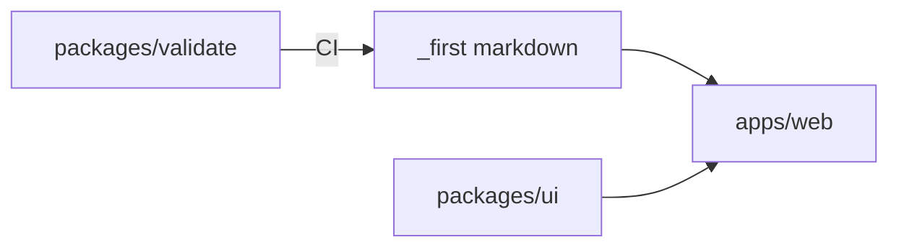

# Architecture First

## Principle

Decide system boundaries, dependency direction, and deployment shape before local implementation choices harden into structural constraints.

## Statement

I treat architecture as the small set of decisions that are expensive to reverse: where responsibilities live, which dependencies point where, what crosses a process or trust boundary, and how the system is deployed. I do not design every class in advance. I make the consequential structure visible before the codebase makes it accidentally.

## Outcome

The system has an inspectable structural model at the level its scale requires. Components have named responsibilities and owners. Dependency direction, external systems, data stores, and deployment units are visible. Consequential choices have rationale and known tradeoffs. Implementation conforms, or the model is updated deliberately.

## Artifacts

- **Fact:** Turborepo: `apps/web`, `packages/ui`, `packages/validate`, `tools/eslint`, `tools/typescript`
- **Fact:** Canonical factory is `_first/` markdown. The site is a projection, not a fork
- **Fact:** Apps depend on packages, never the reverse. Web may read `_first/` at build time
- **Fact:** No Fastify, no database, no `packages/core`
- **Fact:** Deployable: `apps/web` on Vercel
- **Unresolved:** custom domain; remote Turbo cache

## Minimum Useful Artifact

- units: factory markdown, Next site, validator, shared UI tokens
- direction: packages ← apps; site reads factory files
- deploy: Vercel for `apps/web`

## Recipe

1. Inspect `turbo.json`, workspace packages, and Vercel project settings.
2. Do not add an API app to complete this template.
3. Update this file when a deployable is added or removed.

## Validation

- No reverse deps from packages to apps.
- Factory files are not duplicated under `apps/web/content` except maintainer `/docs`.

## Definition of Done

The structural model matches the repo, or the model was updated on purpose.

## Agent Prompt

Apply Architecture First to this repository. Do not add Fastify, Expo, or a database because basilic has them. Keep the factory as markdown.

## Notes

**Architecture vs API:** Architecture names units. API names contracts across them.

**Navigation:** [Generic spec](../principles/ARCHITECTURE.md) · [Human essay](../articles/ARCHITECTURE.md) · [Factory map](../ABOUT.md)
