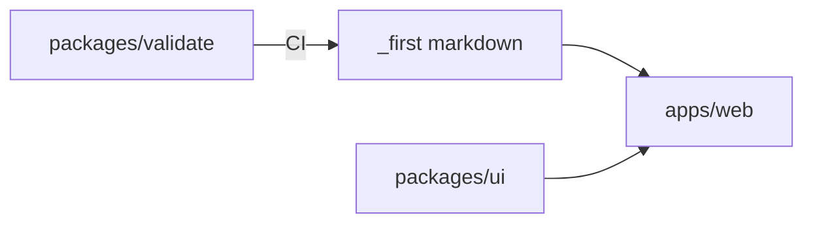

# Architecture First

## Principle

See /f-architecture.

## Artifacts

- **Fact:** Turborepo: `apps/web`, `packages/ui`, `packages/validate`, `tools/eslint`, `tools/typescript`
- **Fact:** Canonical factory is `_first/` markdown. The site is a projection, not a fork
- **Fact:** Apps depend on packages, never the reverse. Web may read `_first/` at build time
- **Fact:** No Fastify, no database, no `packages/core`
- **Fact:** Deployable: `apps/web` on Vercel
- **Unresolved:** custom domain; remote Turbo cache

## Minimum Useful Artifact

- units: factory markdown, Next site, validator, shared UI tokens
- direction: packages ← apps; site reads factory files
- deploy: Vercel for `apps/web`

## Notes

Architecture names units. API names contracts across them. Do not add Fastify, Expo, or a database because another adopter has them. Keep the factory as markdown.

**Navigation:** [Generic spec](../principles/ARCHITECTURE.md) · [Human essay](../articles/ARCHITECTURE.md) · [Factory map](../ABOUT.md)
