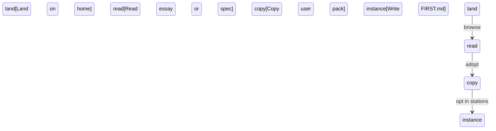

# Journeys First

## Principle

Map how someone finishes a job — including errors, permissions, and state — before implementation invents the path from whichever screen shipped first.

## Statement

The product is not a collection of screens. It is someone trying to finish a job. I map that job from entry to completion before I trust implementation to fill in the gaps. Happy paths are cheap. The product breaks in the alternates: the error nobody designed, the permission that exists on one route but not another, the state with no exit.

## Outcome

Actors, entry points, happy paths, alternates, error paths, permission gates, and completion criteria are documented or explicitly marked unknown. Missing states are visible before code hardens around an incomplete model.

## Artifacts

- **Fact:** Actor — **reader**: lands on `/`, reads What/Why/Spec, opens an article or template
- **Fact:** Actor — **adopter**: copies user pack into `_first/`, writes `FIRST.md` and instance files, merges a pointer into root `AGENTS.md`
- **Fact:** Actor — **maintainer**: edits `_first/articles` or `principles`, runs `pnpm validate`, checks the site projection
- **Fact:** No authenticated journeys. No login, no accounts
- **Fact:** Failure: broken factory markdown fails `pnpm validate`; broken site links fail the Next build or in-browser check
- **Fact:** Landing IA follows SoulSpec’s What / Why / Spec / Get started — not SoulSpec branding or persona files
- **Fact:** Distinctive type: Syne (display), Source Serif 4 (body), IBM Plex Mono (file trees)
- **Fact:** Palette: cool mist paper / violet-slate night, Prussian primary, brass accent. Not basilic teal
- **Fact:** Signature: ten-station rail on the spec index (sequence is real)
- **Fact:** Chrome primitives in `@repo/ui` (button, tokens). Marketing sections live in `apps/web/components/landing`
- **Fact:** No Google-format `DESIGN.md` yet. Tokens in `packages/ui/src/styles/tokens.css`
- **Unresolved:** named journey files beyond this overlay; analytics for first successful use; motion guidelines; copy patterns beyond landing headlines; Google-format `_first/DESIGN.md`

## Minimum Useful Artifact

- actors: reader, adopter, maintainer
- happy path: home → article or spec → get started copy instructions
- alternate: skip essays, copy pack from README
- error: validation failure on factory files; 404 on unknown station slug
- completion: adopter has `_first/` with `FIRST.md` and a root `AGENTS.md` pointer

## Recipe

1. Inspect the site routes and README copy instructions.
2. Walk each actor’s job including the misspelled slug and the skipped essay.
3. Mark unknown states unresolved. Do not invent auth.
4. Update this file when a real journey ships.

## Validation

- Every mapped state traces to a route, a command, or an explicit deferral.
- Permission gates: none. The site is public; the factory is git.

## Definition of Done

The jobs above are finishable from files and the running site without reconstructing the path from chat.

## Agent Prompt

Apply Journeys First to this repository. Do not map Basilic auth journeys. Stay on reader, adopter, and maintainer paths.

## Notes

**Journeys vs Product:** Product names the job. Journeys name how it finishes and how the interface expresses it.

**Journeys vs Data:** Conversational resume is in the job. Data owns the memory store.

**Navigation:** [Generic spec](../principles/JOURNEYS.md) · [Human essay](../articles/JOURNEYS.md) · [Factory map](../ABOUT.md)
